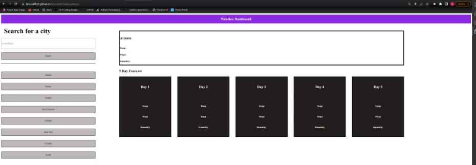

# Module6ChallengeRepo
Repository for module 6

## Project goals

The goal of this project was to create a weather dashboard using the Open Weather api, so that a 5 day forecast appears when you search for a city.
It also includes a few options in the form of buttons for major cities for easy access in a single button click.

### Link for deployed application

You can find the link for the deployed application [Here](https://hmccarthy1.github.io/Module6ChallengeRepo/)

### Screenshot for deployed application

